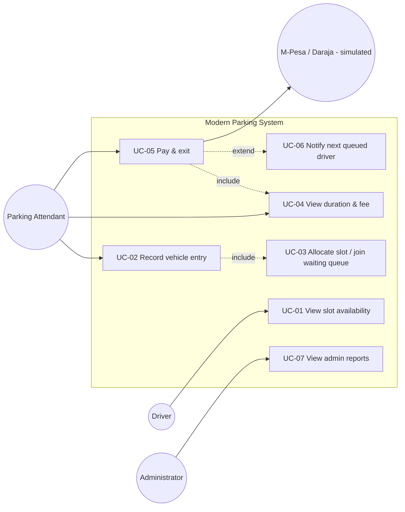

## 1. Actors

| Actor | Description |
| --- | --- |
| **Driver** | A motorist who wants to park or leave. Interacts indirectly through the attendant or a display at the gate. |
| **Parking Attendant** | Operates the entry/exit terminals: records entries, looks up tickets, collects payments. Primary user of the frontend tabs *Entry* and *Exit & Payment*. |
| **Administrator** | Reviews daily revenue by payment method, vehicle counts, occupancy rate and recent exits via the *Admin* tab; audits actions through the `audit_log`. |
| **M-Pesa (Daraja API)** | *External, simulated.* Sends the STK push and the payment confirmation callback. |
| **System (Timer)** | Internal actor that computes elapsed parking duration at lookup/payment time. |

## 2. Use case diagram

## 3. Use case summary

| ID | Use case | Primary actor | Priority |
| --- | --- | --- | --- |
| UC-01 | View slot availability | Driver / Attendant | High |
| UC-02 | Record vehicle entry | Parking Attendant | High |
| UC-03 | Allocate slot (or join waiting queue) | System | High |
| UC-04 | View duration & fee | Parking Attendant | High |
| UC-05 | Pay & exit (M-Pesa / cash / free) | Parking Attendant + Driver | High |
| UC-06 | Notify next driver in waiting queue | System | Medium |
| UC-07 | View admin reports | Administrator | Medium |

---

